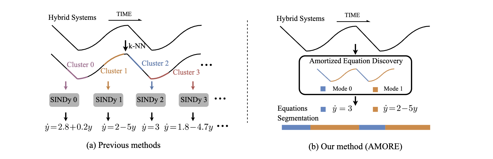

# Amortized Equation Discovery in Hybrid Dynamical Systems
Official code of Amortized Equation Discovery in Hybrid Dynamical Systems in ICML 2024

<div align=center>

</div>

## 🚀 Performance

<div style="text-align: justify;">
  AMORE demonstrates remarkable proficiency in handling complex segmentation tasks that require: (a) reasoning based on world knowledge; (b) inference of future events; and (c) a comprehensive understanding of video content.
</div>

<div align=center>

</div>

## 🛠️ Installation
```shell
pip install -r requirements.txt
```

## 🦄 Training and Validation

### 1. Training Data Preparation

Before training, please download the [datasets](https://drive.google.com/drive/folders/19g7c1a2okoCd_OEt3D-l6nh27nXuNNAA?usp=sharing) and put them in [data](data/). The Mass-spring Hopping dataset has already been put in the folder, which is a good start.

### 2. Training and evaluating AMORE

```shell
python run-amore.py --config "./configs/spring-mass.yaml" --device "cuda:0"
```

## ⭐ Cite

If you find this project useful in your research, please consider citing:

```
@article{liu2024amortized,
  title={Amortized Equation Discovery in Hybrid Dynamical Systems},
  author={Liu, Yongtuo and Magliacane, Sara and Kofinas, Miltiadis and Gavves, Efstratios},
  journal={arXiv preprint arXiv:2406.03818},
  year={2024}
}
```

## 🎖️ Acknowledgement
This work is built upon the [SNLDS](https://github.com/google-research/google-research/tree/master/snlds), [REDSDS](https://github.com/abdulfatir/REDSDS), and [PySINDy](https://github.com/dynamicslab/pysindy).
